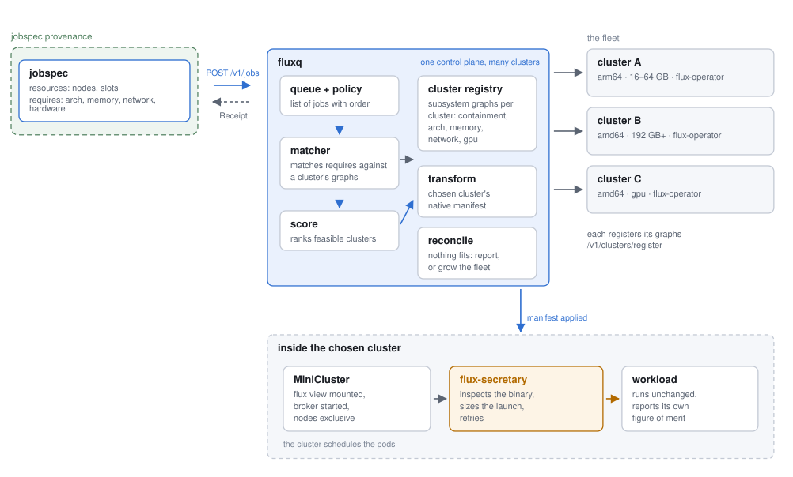

# fluxq

> a fleet-level queue manager for descriptive dispatch

[](https://doi.org/10.5281/zenodo.22239934)


A prototype of the `text prompt → select → transform → dispatch → monitor`
pipeline, built with Fluxion. `fluxq` is the fleet-level analog of Flux's
`qmanager`: it allows for registration and query against **fleet resource graphs**
(whole clusters as vertices) to pick a target cluster. After candidate scoring
and selection, each jobspec is transformed and dispatched.

## Quickstart

Everything you give the server is **JGF** (resource graphs) or a **jobspec**.
Since Fluxion has limitations for subsystems and query, we use an approach that
defines a separate resource graph per cluster subsystem, and runs matches concurrently.
Each cluster receives a secret, and attaches subsystems as JGF graphs. Subsystems
are either descriptive or not, where non-descriptive means there are countable
things. For example, the containment subsystem is not descriptive in that when
we allocate a core to a user, that user exclusively gets it. A software subsystem
is descriptive because we primarily need to ensure that a piece of software or
dependency exists, and there is hypothetically unlimited access to it. Descriptive
subsystems always have satisfy run against them, and non-descriptive need a match
allocate. Let's do a quickstart to create a 3-cluster faux fleet.

| cluster | manager | nodes×cores | software (tree) |
|---------|---------|-------------|-----------------|
| alpha | flux-operator | 2×8 | `lammps→kokkos`, `gromacs` |
| beta | slurm-operator | 4×16 | `lammps→openmp`, `amber` |
| gamma | k8s-job | 2×4 | `gromacs`, `amber` |

So `lammps` is on alpha+beta (but with **different** dependency subtrees),
`gromacs` on alpha+gamma, `amber` on beta+gamma.

```bash
# Terminal 1 — build with the REAL Fluxion matcher. Run this inside the
# .devcontainer, where flux-sched and LD_LIBRARY_PATH are already set (see §7).
make fluxion
./bin/fluxq serve
```

And now in a second terminal, let's register a new cluster.

```bash
# Register alpha (empty). Prints a secret — save it for edits.
# ./bin/fluxq cluster register --name alpha --manager flux-operator
./bin/fluxq cluster register --name alpha --manager flux-operator --config emulate=true
export FLUXQ_SECRET=<the printed secret>
```

Now let's define subsystems. Descriptive subsystems are for things that aren't technically countable.
For example, software is uniform across nodes, and me using spack or MPI does not block it for anyone else.
We just need to know it is there.

```bash
# Attach containment (countable) and software (descriptive) — both JGF files.
./bin/fluxq cluster subsystem register --cluster alpha --name containment --descriptive=false --file data/quickstart/alpha.containment.json
./bin/fluxq cluster subsystem register --cluster alpha --name software --descriptive=true  --file data/quickstart/alpha.software.json
```

Now view the list - we have a cluster! Note that it is emulated.

```bash
./bin/fluxq cluster list

# Ask which clusters could run lammps-WITH-kokkos — ranked, allocates NOTHING:
./bin/fluxq satisfy --file examples/job-lammps-kokkos.json
./bin/fluxq submit --file examples/job-lammps-kokkos.json
./bin/fluxq jobs
```

Now view the list — we have a cluster. The DISPATCH column shows `emulated`: an
emulated cluster is **satisfy-only** (it informs selection but is never
dispatched to — emulating a real submit isn't meaningful). When you are done, you
can unregister it:

```bash
# Done experimenting with selection? Unregister it and register a real target:
./bin/fluxq cluster unregister --name alpha
```

### Dispatching to a real flux instance

The clusters above are **emulated** (no `--config`, so dispatch is validated and
faked, never contacted). To dispatch for real, register a cluster with backend
**dispatch config**. For Flux that's a `uri`: `local` reaches the ambient broker
this server runs inside; a remote instance is `ssh://host/run/flux/local`. Omit
`--config` and the cluster stays emulated.

```bash
flux start
# --config uri=local opts this cluster into REAL dispatch (the ambient broker)
./bin/fluxq cluster register --name local --manager flux-uri --config uri=$FLUX_URI
export FLUXQ_SECRET=<printed>

# Derive the containment subsystem straight from the running instance (RV1):
./bin/fluxq cluster subsystem from-flux --cluster local --print
./bin/fluxq cluster subsystem from-flux --cluster local

# Submit — this actually runs `flux submit` on your broker:
./bin/fluxq satisfy --file examples/job-hostname.json
./bin/fluxq submit --file examples/job-hostname.json
./bin/fluxq jobs
./bin/fluxq log job-0002
./bin/fluxq cluster unregister --name local
```

### Dispatching to Kubernetes (a local kind cluster)

Same model, different backend. Create a local cluster and register it with a
kubeconfig **context** (kind names it `kind-<clustername>`), or an explicit
`kubeconfig` path; add `namespace` if not `default`. k8s jobs need a container
image (`attributes.user.image`).

```bash
# You likely need to run this outside of the dev container
make kind-up

./bin/fluxq cluster register --name k8s --manager k8s-job --config context=kind-fluxq
export FLUXQ_SECRET=<printed>

# Get the kubeconfig from your local machine and write to /home/vscode/.kube/config
mkdir -p /home/vscode/.kube
# From outside
kind get kubeconfig --name fluxq --internal > kubeconfig-internal.yaml
mv ./kubeconfig-internal.yaml ~/.kube/config

# attach containment describing the cluster's nodes (a JGF; see data/quickstart)
./bin/fluxq cluster subsystem register --cluster k8s --name containment --descriptive=false --file data/quickstart/alpha.containment.json

./bin/fluxq submit --file examples/job-k8s.json   # kubectl apply a batch/v1 Job
./bin/fluxq jobs                                   # HANDLE is job.batch/<name>
make kind-down
```

### A mixed fleet: one job to flux, another to Kubernetes

With both backends registered, selection routes each job to the cluster that can
actually satisfy it. The lever is the **software** subsystem: give each cluster a
different package set and a job's `requires.software` decides where it can land.
Here the flux cluster has `lammps→kokkos` and the kind cluster has `gromacs`, so
the two demo jobs (`data/demo/`, `examples/job-{lammps,gromacs}.json`) are each
feasible on exactly one backend.

```bash
# 1. a real flux instance and a real kind cluster
flux start
make kind-up

# 2. flux cluster: containment from the live instance + lammps/kokkos software
./bin/fluxq cluster register --name hpc --manager flux-uri --config uri=$FLUX_URI
export HPC=<printed secret>
FLUXQ_SECRET=$HPC ./bin/fluxq cluster subsystem from-flux --cluster hpc
FLUXQ_SECRET=$HPC ./bin/fluxq cluster subsystem register --cluster hpc --name software --descriptive=true --file data/demo/flux.software.json

# 3. kind cluster: containment (sample JGF stand-in) + gromacs software
./bin/fluxq cluster register --name k8s --manager k8s-job --config context=kind-fluxq
export K8S=<printed secret>
FLUXQ_SECRET=$K8S ./bin/fluxq cluster subsystem register --cluster k8s --name containment --descriptive=false --file data/quickstart/alpha.containment.json
FLUXQ_SECRET=$K8S ./bin/fluxq cluster subsystem register --cluster k8s --name software --descriptive=true --file data/demo/k8s.software.json

# 4. predict the routing, then dispatch — lammps only fits hpc, gromacs only k8s
./bin/fluxq satisfy --file examples/job-lammps.json     # CLUSTER: hpc  (MATCHED software)
./bin/fluxq satisfy --file examples/job-gromacs.json    # CLUSTER: k8s  (MATCHED software)
./bin/fluxq submit  --file examples/job-lammps.json
./bin/fluxq submit  --file examples/job-gromacs.json
./bin/fluxq jobs
# JOBID     NAME         STATE      CLUSTER  HANDLE
# job-0001  lammps-job   COMPLETED  hpc      ƒsqnNWs                 <- real flux jobid
# job-0002  gromacs-job  COMPLETED  k8s      job.batch/gromacs-job   <- kubectl-applied Job
```

The routing is feasibility: `lammps→kokkos` is absent from the kind cluster
and `gromacs` is absent from the flux cluster, so each job matches exactly.
A job too large for one cluster's nodes is
infeasible there regardless of software.

### The Jobspec

We are using the Flux v1 jobspec (RFC 25) with an added block requires for subsystems.
This is based on work that I did for [jobspec nextgen](https://compspec.github.io/jobspec/docs/#/spec?id=requires).
I still like the design :)

```json
{
  "version": 1,
  "resources": [
    {"type": "node", "count": 1, "with": [
      {"type": "slot", "count": 1, "label": "default",
       "with": [{"type": "core", "count": 8}]}
    ]}
  ],
  "tasks": [{"command": ["lmp", "-i", "in.reaxff"], "slot": "default",
             "count": {"per_slot": 1}}],
  "attributes": {"system": {"duration": 3600, "job": {"name": "lammps-kokkos"}},
                 "user": {"image": "lammps:latest"}},
  "requires": {
    "software": [{"type": "lammps", "with": [{"type": "kokkos"}]}]
  }
}
```

The top-level resources, tasks, and attributes are the **containment** request,
matched as-is (it is already a valid Flux jobspec. Each `requires.<subsystem>`
is another section, in the *same* Flux resource vocabulary, that we use for
fluxq to query subsystems. This allows us to fully define a job's requirements
across subsystems in one jobspec. Preloading is also JGF: `serve --fleet <dir>`
loads a directory of JGF clusters. And storage backends:

```bash
./bin/fluxq serve --queue sqlite        # durable queue, local file, no server
./bin/fluxq serve --queue postgres      # durable queue for production
make fluxion                             # build with the REAL Fluxion matcher (see §7)
```

An empty cluster (no containment yet) is legal — it just can't schedule anything
until a countable subsystem is attached.


## The pipeline

```
POST /v1/jobs/submit ─▶ [queue: provisional]
                      │  schedule loop (policy picks order)
                      ▼
               [matcher: Satisfy?] ── impossible ─▶ FAIL (+ optional suggestion)
                      │  feasible on ≥1 cluster
                      ▼
               [matcher: Match] ── all full now ─▶ wait, recheck next pass
                      │  allocation = a chosen cluster
                      ▼
               [transform] ─▶ native manifest | command
                      │
                      ▼
               [driver.Submit] ─▶ native remote handle
                      │  monitor loop
                      ▼
               [driver.Status] ─▶ terminal ─▶ matcher.Free (release the nodes)
```

The **jobspec is the interlingua** (`pkg/jobspec`) — a real Flux jobspec
(RFC 25) plus a `requires` block: selection matches on it, transform compiles
out of it.

## Concepts

- **Fleet & JGF graphs.** Each cluster is a set of flux-sched resource graphs — countable containment plus descriptive capability trees like software or network.
- **Matcher.** Checks which clusters can satisfy every requested subsystem, then allocates the countable ones on the chosen cluster; Fluxion for real, a pure-Go double offline.
- **Scoring.** Among feasible clusters, prefers the best fit and breaks ties randomly.
- **Policies.** Decide queue order — first-come-first-served, or backfill so a blocked job doesn't hold up smaller ones.
- **Queue.** In-memory by default, or durable via SQLite/Postgres.
- **Transform.** Turns the jobspec into each backend's native form; today templated, eventually agentic.
- **Dispatch.** One driver per backend; emulated clusters are satisfy-only, Kubernetes applies any manifest generically, Flux dispatches through libflux.
- **Reconcile.** When a job can't fit anywhere, optionally suggest a reshaped one that would.

Here is the architecture:



## Life of a Job

Follow the numbers against the commands in §1.

1. **Submit.** `fluxq submit` (or `POST /v1/jobs/submit`) puts a job in the queue in
   the `SUBMITTED` (provisional) state.

2. **Schedule pass (policy).** Every tick the manager pulls provisional jobs in
   the order the **policy** dictates (`FCFS` or `Backfill`) and tries to place
   each one. Backfill can run a small job behind a reserved head-of-line job.

3. **Feasibility — can this job EVER run?** (`matcher.Satisfy`) A cluster passes
   if every subsystem the job requests **satisfies** against that cluster's
   graph (e.g. `lammps`, `efa`) AND its containment shape could structurally
   hold the job (enough nodes of the right size).
   - If the fleet is **empty**, nothing is "impossible" yet → the job **waits**.
   - If clusters exist but **none** can ever satisfy it (missing software, or
     too big for every cluster) → the job **FAILS** as impossible.

4. **Capacity — can it run right now?** (`matcher.Match`) Among the feasible
   clusters, is there one with **free** nodes? If yes, the job is assigned to
   that cluster (an *allocation*). If all feasible clusters are momentarily
   full, the job is **not** failed — it waits with a "waiting: N candidates,
   none free" note and is rechecked each pass.

5. **Transform.** The chosen cluster's manager type decides the native form:
   a MiniCluster CR (flux-operator), a `batch/v1` Job (k8s), a SlurmJob
   (slurm-operator), or a `flux submit` command (flux-uri). `transform` renders
   the agnostic jobspec into that dialect.

6. **Dispatch.** The per-manager `driver.Submit` sends the artifact to the
   cluster and returns a native handle (a real flux jobid, or an emulated
   handle like `fluxjob-fA1B2`). Backend drivers handle dispatch.

7. **Monitor & free.** A monitor loop polls `driver.Status` for active jobs.
   On a terminal state (completed/failed/timeout) it releases the allocation
   (`matcher.Free`) so those nodes are available again. `fluxq jobs` shows the
   whole queue at any moment.


### In the devcontainer

> recommended

`.devcontainer/` builds on `vanessa/fluxion-quantum`, which has flux-sched
prebuilt at `/opt/flux-sched` (plus Postgres for the durable queue). Open the
repo in it — VS Code “Reopen in Container”, or `devcontainer up
--workspace-folder .` — then use the Fluxion make targets (the CGO flags for
`/opt/flux-sched` are baked in):

```bash
make fluxion        # build with the REAL Fluxion matcher
make fluxion-test   # run the whole suite against real reapi (incl. the cross-matcher conformance)
make fluxion-bench  # real Fluxion match benchmarks
make run            # serve with real Fluxion selection
```

### Jobspecs

```bash
pip install -e ./client/py[aws] --break-system-packages
```

Run

```bash
fluxq-select --manifests-dir manifests --clusters clusters.json --goal "run LAMMPS REAX efficiently, CPU to minimize costs." --out-dir jobspecs --model us.anthropic.claude-sonnet-5
```

### To test flux-core

```bash
make fluxcore
flux start bash -c '
  ./bin/fluxq serve &
  sleep 1

  ./bin/fluxq managers        # flux-uri -> REAL DISPATCH: yes  (proves libflux is linked)

  SECRET=$(./bin/fluxq cluster register --name hpc --manager flux-uri --config uri=local | sed -n "s/^secret: //p")
  export FLUXQ_SECRET=$SECRET
  ./bin/fluxq cluster subsystem from-flux --cluster hpc

  ./bin/fluxq submit --file examples/job-hostname.json
  sleep 2
  ./bin/fluxq jobs            # HANDLE is a real ƒ jobid; STATE COMPLETED; NOTE "finished (exit 0)"
'
```


### TODO:

- Right now the real dispatch returns a JobID. Arguably we can do some kind of request to the cluster to get a lot, status, etc.
- The Kubernetes interfaces should have common underlying abstraction.
- Agentic transform needs to be done.
- It should not be possible to re-register an existing cluster!


### Reapi Issues

These are issues I am logging as I work with reapi:

 - [InitContext](https://github.com/flux-framework/flux-sched/issues/1525) cannot extend beyond one process due to string interner. fluxq works around it by running one reapi context per worker subprocess.
 - The traverser requires a containment subsystem, so every subsystem graph fluxq loads carries a containment backbone (its resource types are the subsystem's, but the structural subsystem is `containment`).

## License

HPCIC DevTools is distributed under the terms of the MIT license.
All new contributions must be made under this license.

See [LICENSE](https://github.com/converged-computing/cloud-select/blob/main/LICENSE),
[COPYRIGHT](https://github.com/converged-computing/cloud-select/blob/main/COPYRIGHT), and
[NOTICE](https://github.com/converged-computing/cloud-select/blob/main/NOTICE) for details.

SPDX-License-Identifier: (MIT)

LLNL-CODE- 842614
